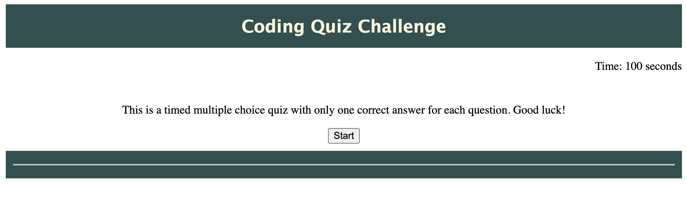
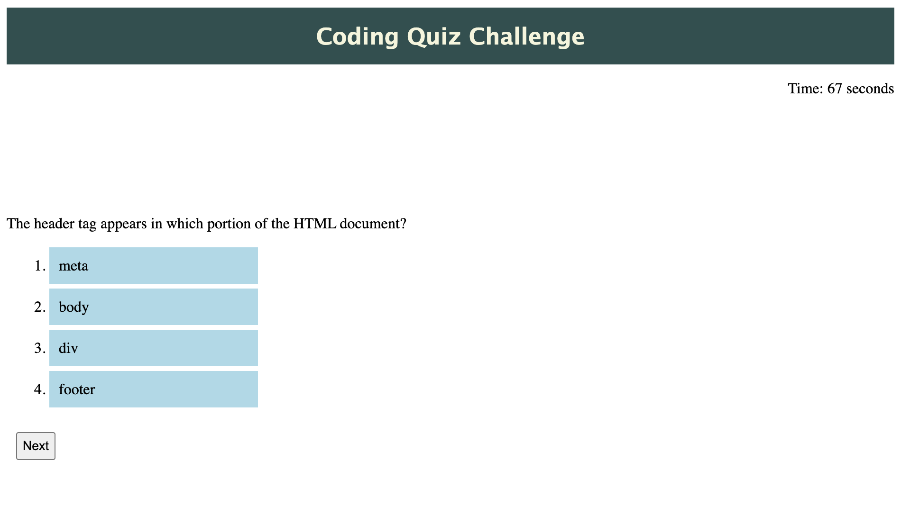
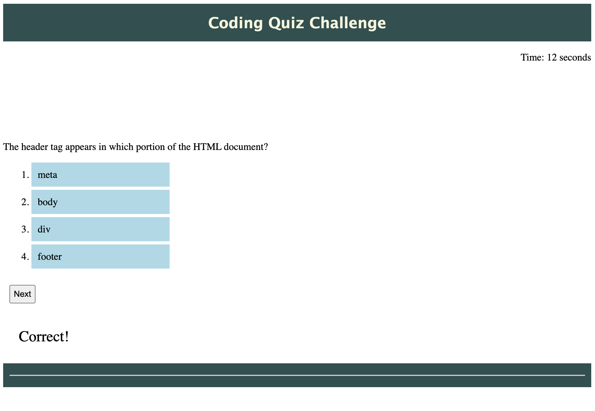
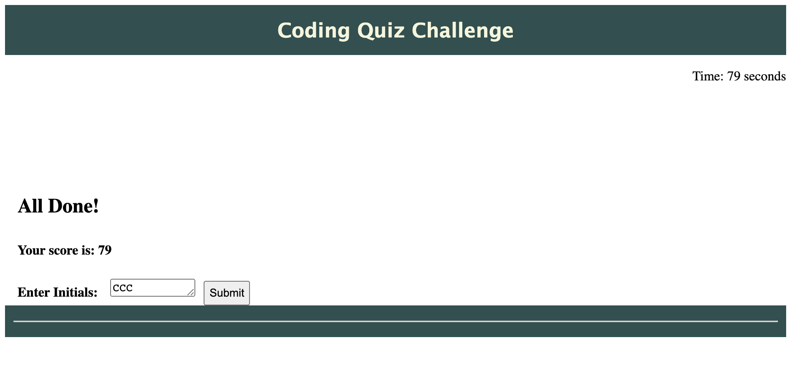
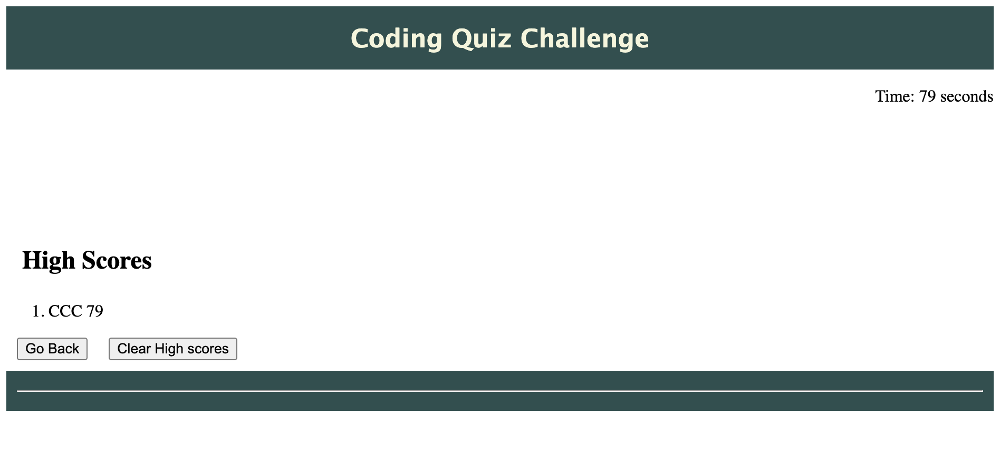
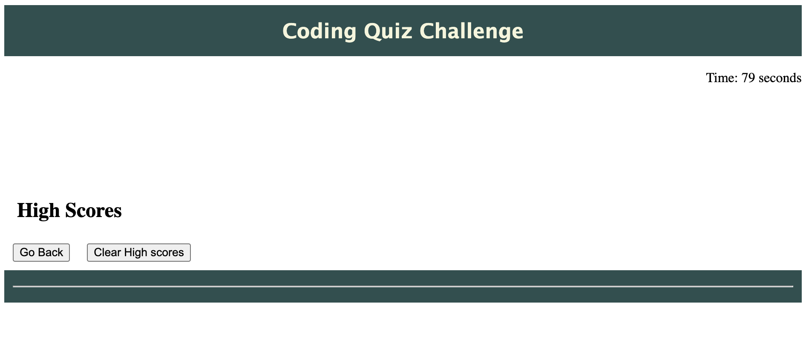

# Coding Quiz
## Table of Contents
* [Description](#description)
* [Screenshots](#screenshots)
* [Code Snippets](#code-snippets)
* [Technologies Used](#technologies-used)
* [Credits](#credits)
* [Author Links](#author-links)

***

## Description
This application is a timed Coding Quiz. The user is presented with a question and multiple choices for an answer. If an answer is correct, the next question will be presented while the timer counts down. A wrong answer results in the timer reducing by 10 seconds. The score is the time remaining when all questions have been answered (or skipped!). The score can be stored with the user's initials. The page has been deployed to the Github Pages at [Coding Quiz](https://sbhikshe.github.io/CodingChallenge/)


## Screenshots

### *1. The intial screen for the quiz*


### *2. Display a question*


### *3. The user's answer is checked.*


### *4. Display the score.*

***

### *5. Retrieve the saved score.*

***

### *6. Clear the score.*

***


## Code Snippets
### *1. On clicking the Start button, this handler starts a timer for 100 seconds. Use setInterval() to check for various conditions every second - put out the first question, has the user responded so we can display the next question, has the timer run out etc.*
```
  function startQuiz() {

    var timerId = setInterval(function() {
        quizTime--;
        timerEl.textContent = quizTime;

        if (quizTime <= 0) {
            clearInterval(timerId);
            displayScores();
        } else {
            var isQuestionDisplayed = runQuiz();
            if ( isQuestionDisplayed === "new") {
            } else if (isQuestionDisplayed === "same") {
                console.log("Continue to display same question, Waiting for user to respond");
            } else if (isQuestionDisplayed === "none") {
                  clearInterval(timerId);
                displayScores();
            }
        }
    }, 1000);
}

```

### *2. Set up the elements to show the question and the answer choices. Use mouseenter and mouseleave events to highlight a choice in grey when the user moves over it.*
```
  questionEl = document.createElement("p");
    qaEl.appendChild(questionEl);

    /* The list of choices for the answer */
    answerListUl = document.createElement("ol");
    qaEl.appendChild(answerListUl);

    for (var i = 0; i < 4; i++) {
        answersLi[i] = document.createElement("li");
        answerListUl.appendChild(answersLi[i]);
        answersLi[i].setAttribute("style", "background-color: lightblue; width: 200px; padding: 10px; margin: 5px;");
        answersLi[i].addEventListener("mouseenter", function(event) {
            var item = event.target;
            item.setAttribute("style", "background-color: lightgrey; width: 200px; padding: 10px; margin: 5px;");

        });
        answersLi[i].addEventListener("mouseleave", function(event) {
            var item = event.target;
            item.setAttribute("style", "background-color: lightblue; width: 200px; padding: 10px; margin: 5px;");

        });
    }

```
### *3. Store, retrieve and remove the initials and score to / from local storage.*
```
   /* store the initials and the score to local storage */
    localStorage.setItem("score", initialsEl.value.toUpperCase() + " " + quizTime);

```
```
 /* for now, storing only one score */
    highScoresLi[0] = document.createElement("li");
    highScoresLi[0].textContent = localStorage.getItem("score");
    highScoresListOl.appendChild(highScoresLi[0]);
```
```
function clearScores() {
    localStorage.removeItem("score");
    highScoresListOl.removeChild(highScoresLi[0]);
}
```

***
## Technologies Used
- HTML
- CSS
- JavaScript
- Web APIs

## Credits
[Document Object Model](https://developer.mozilla.org/en-US/docs/Web/API/Document_Object_Model)

## Author Links
[LinkedIn](https://www.linkedin.com/in/sripriya-bhikshesvaran-8520992/)\
[Github](https://github.com/sbhikshe)
